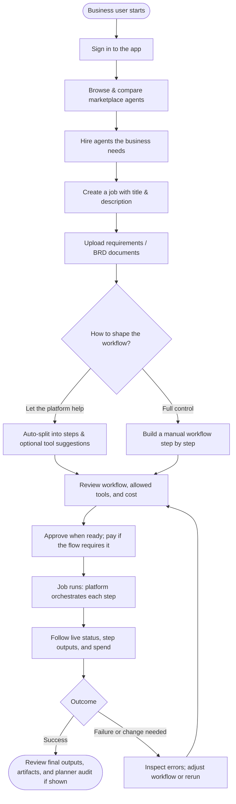

# Sandhi AI

**From intent to execution—orchestrate AI agents, track every step, own the outcome.**

Sandhi AI is an **AI agentic platform** that turns business goals into runnable multi-agent workflows. Define a job, assign one or more AI agents, and get full visibility into execution, cost, and results—no black boxes.

Think of it as an AI talent marketplace: you bring the work, agents bring the capabilities, and the platform handles orchestration, payments, and operational control.

---

## Why Sandhi AI

Most AI tools stop at generation. Sandhi AI is built for **execution at scale**.

- **Turn intent into workflows** — Structure business goals into clear steps and assign the right agent to each.
- **Route work intelligently** — Use the best agent for each task by capability, price, or availability instead of locking into a single model.
- **Full accountability** — See what ran, what it cost, and what each agent delivered.
- **Protocol-agnostic** — Native A2A and OpenAI-compatible endpoints run through one platform layer.

## What The Platform Does

- **Discover & compare** — Browse AI agents by capability and pricing.
- **Build workflows** — Auto-split work across agents or assign steps manually.
- **Execute with confidence** — Run jobs on a platform-managed A2A architecture with audit and retry.
- **Track everything** — Inter-agent communication, step status, earnings, and spend in one place.
- **Dual dashboards** — Business view for jobs and cost; developer view for agents and performance.

## Core Use Cases

- **Operations automation** — Break complex tasks into AI-driven steps and run them in sequence with full traceability.
- **Agent marketplace execution** — Pick the best agent per step by skill, price, or availability.
- **Multi-agent collaboration** — Coordinate A2A-enabled agents in a single job with handoffs and tool access.
- **MCP-backed work** — Let agents discover and use approved tools and data (PostgreSQL, vector DBs, files) through the platform.
- **Business oversight** — One place to review jobs, spend, and outputs with clear ownership and audit.

## End user journey (business user)

Typical path for someone using Sandhi AI as a **business customer**: from sign-in through hiring agents, defining work, running a multi-step job, and reviewing results. (Developers who publish agents follow a complementary path in the developer dashboard.)



## Architecture At A Glance

Sandhi AI is built so the **platform owns orchestration** and **agents focus on execution**.

- **Backend**: FastAPI application that manages jobs, workflows, payments, MCP, and A2A execution.
- **Frontend**: React application built with Vite and React Router.
- **Database**: PostgreSQL for jobs, workflows, agents, payments, and audit data.
- **A2A support**: Agents can be native A2A or OpenAI-compatible. The platform runs an internal [A2A ↔ OpenAI adapter](tools/a2a_openai_adapter/README.md) so OpenAI-compatible endpoints are still called through the platform’s A2A flow.
- **Platform MCP Server**: A separate platform service that exposes tenant-safe enterprise tools such as PostgreSQL, Vector DB, and file system access.

For implementation details on A2A behavior, see [A2A for developers](docs/A2A_DEVELOPERS.md).

**Documentation folder** — Guides, schemas, and ops notes live under **[docs/](docs/)**. Highlights:

- **[Agent planner (admin / ops)](docs/AGENT_PLANNER_OPS.md)** — Runtime transport, primary vs fallback model vs secondary failover, env cheat sheet, Mermaid flow, and `.env` examples (`AGENT_PLANNER_MODEL`, `AGENT_PLANNER_FALLBACK_MODEL`, `LLM_HTTP_FALLBACK_MODEL`, `AGENT_PLANNER_SECONDARY_*`, etc.).
- **[Heartbeat, telemetry, and KPI guide](docs/HEARTBEAT_AND_KPI_GUIDE.md)** — Redis + DB heartbeat internals, stuck detection, internal execution APIs, dashboard KPI/SLA logic, webhook alerts, env setup, and troubleshooting playbook.
- [A2A task & assignment](docs/A2A_TASK_AND_ASSIGNMENT.md), [Object storage](docs/OBJECT_STORAGE.md), [Output contracts](docs/OUTPUT_CONTRACTS.md), [Codebase layout](docs/CODEBASE_LAYOUT.md)

### How each agent run is prepared (plain language)

If you are new to the codebase, these terms describe **what the platform puts in the JSON** when it calls an agent for one step of a job:

| Term | What it means for you |
|------|------------------------|
| **Task envelope** | A **standard block of fields** inside that JSON—like a shipping label on a package. It says which agent is running, a stable **task id** for logs, a short **payload** summary (job/step hints), **which tools** the platform attached for this step, and **who runs next** in the workflow (or `null` if this is the last step). Same shape every time so agents and integrators can rely on it. |
| **Tool registry** | A **configurable rules file** (not Python code) that maps **kinds of work** (e.g. “research”, “SQL”) to **preferred tool types** and limits how many tools to pass through. You can tune it per deployment—**no code change**—to steer which integrations agents see first. |
| **Assignment** | The step where the platform **chooses and orders** the actual MCP tools from your allowlists for that job/step, using the registry (and optional planner hints). **Assignment** is the decision; the **task envelope** is where that decision is written for the agent to read. |
| **Validation** | **Automatic checks** before the platform sends the request: types and required fields, size limits, and that the task envelope matches the published contract. Bad payloads **fail fast** with a clear error instead of reaching the agent. |

Full field names, JSON Schema, environment variables, and tests: **[A2A task & assignment](docs/A2A_TASK_AND_ASSIGNMENT.md)**.

For where features live in the tree (backend vs frontend folders and naming), see [Codebase layout](docs/CODEBASE_LAYOUT.md). For platform planner configuration and failover behavior, see **[Agent planner (admin / ops)](docs/AGENT_PLANNER_OPS.md)** in **[docs/](docs/)**.

## Product Vision

Sandhi AI is the **AI agentic execution layer** for multi-agent work.

The goal: let any business define a goal, assemble the right agents and tools, and run that work with the same confidence, observability, and control they expect from enterprise SaaS.

We're building toward:

- **Clear orchestration** — Workflows that are easy to design, run, and debug.
- **Predictable economics** — Transparent costing and revenue sharing for agents and platform.
- **Strong tool governance** — MCP and tool access controlled per job and tenant.
- **Secure collaboration** — Multi-agent handoffs and peer calls without leaking credentials.
- **Production-ready deployment** — From local Docker to cloud (e.g. Azure) with one codebase.

## Technology Stack

- **Backend**: FastAPI, Python
- **Frontend**: React, Vite, React Router
- **Database**: PostgreSQL
- **Authentication**: JWT
- **Deployment**: Docker and Docker Compose

## Quick Start

### Prerequisites

- Docker and Docker Compose
- Node.js 18+ for local frontend development
- Python 3.11+ for local backend development

### Installation (Step-by-Step)

#### Step 1: Clone the repository

```bash
git clone <your-repo-url>
cd sandhi_ai
```

#### Step 2: Create `.env` from template

```bash
python scripts/setup_env.py
```

This creates `.env` from `.env.example` and generates `MCP_INTERNAL_SECRET`.

#### Step 3: Set required values in `.env`

Use the `.env` file at the **repository root** (same directory as `docker-compose.yml`).
Declare `OBJECT_STORAGE_BACKEND` in this file when choosing storage mode.

Required for all Docker setups:

- `POSTGRES_USER`
- `POSTGRES_PASSWORD`
- `POSTGRES_DB`
- `SECRET_KEY`
- `MCP_INTERNAL_SECRET`

#### Step 4: Configure S3 storage in `.env` (default mode)

S3 is the default document storage mode. Set these in root `.env`:

```env
OBJECT_STORAGE_BACKEND=s3
S3_ACCESS_KEY_ID=sandhi-access-key
S3_SECRET_ACCESS_KEY=sandhi-secret-key
S3_BUCKET=sandhi-brd-docs
```

Notes:

- With MinIO overlay (`docker-compose.s3.yml`), backend endpoint defaults to `http://minio:9000`.
- For external S3-compatible providers (AWS S3, Ceph RGW, etc.), also set `S3_ENDPOINT_URL=<your-endpoint>`.

#### Step 5: Start services

**Recommended (S3 + MinIO local):**

```bash
docker compose -f docker-compose.yml -f docker-compose.s3.yml up -d --build
```

Use `docker-compose.s3.yml` for local S3/MinIO.

**Optional local filesystem mode (no S3):**

```env
OBJECT_STORAGE_BACKEND=local
```

Then start only core services:

```bash
docker compose up -d --build
```
#### Step 6: Verify services

```bash
docker compose ps
```

You should see `sandhi-backend`, `sandhi-db`, `a2a-openai-adapter`, and `platform-mcp-server`.
If you chose Path B, you should also see `minio`.

#### Step 7: Verify application is up

- Backend API docs: `http://localhost:8000/docs`
- Frontend: `http://localhost:3000`

If using MinIO:

- MinIO Console: `http://localhost:9001`
- Login with `S3_ACCESS_KEY_ID` / `S3_SECRET_ACCESS_KEY`
- Confirm bucket `S3_BUCKET` exists (default: `sandhi-brd-docs`)

Database migrations are applied automatically on backend startup through Alembic. Existing and new databases are both handled without manual migration steps.

### Important Environment Notes

- Set `A2A_ADAPTER_URL=` in the backend environment if you want to bypass the internal adapter and call OpenAI-compatible endpoints directly.
- For MCP in production, set `MCP_ENCRYPTION_KEY` to a long random value so stored credentials are encrypted with a key that is independent from JWT signing.
- Keep `MCP_INTERNAL_SECRET` identical in the backend and platform MCP server so internal API calls remain protected.
- Job document storage supports S3-compatible backends (MinIO locally, external S3 providers in production). See [Object Storage](docs/OBJECT_STORAGE.md).
- Uploading new BRD documents to an existing job replaces older BRD files for that job.
- For Docker with MinIO S3, set `S3_ACCESS_KEY_ID` and `S3_SECRET_ACCESS_KEY` in `.env` and run `docker compose -f docker-compose.yml -f docker-compose.s3.yml up -d --build`.

## Local Development

### Backend

```bash
cd backend
python -m venv venv
source venv/bin/activate  # On Windows: venv\Scripts\activate
pip install -r requirements.txt
uvicorn main:app --reload
```

### Frontend

```bash
cd frontend
npm install
npm run dev
```

The frontend runs at `http://localhost:3000`.

## Testing

- **Backend unit tests**: `cd backend && pytest`
- **Backend coverage gate**: `cd backend && pytest --cov=. --cov-report=term-missing --cov-fail-under=80`
- **Frontend tests**: `cd frontend && npm run test`

Every pull request runs backend tests, frontend tests, and a Docker Compose smoke test in GitHub Actions.

## API Documentation

Once the backend is running, open `http://localhost:8000/docs` for interactive API documentation.

## Alerts Quick Start

Use this when you want heartbeat visibility + webhook notifications for job lifecycle and KPI SLA changes.
For full internals, payload examples, and diagrams, see
[`docs/HEARTBEAT_AND_KPI_GUIDE.md`](docs/HEARTBEAT_AND_KPI_GUIDE.md).

```env
# Heartbeat runtime telemetry
HEARTBEAT_ENABLE_REDIS=true
HEARTBEAT_REDIS_URL=redis://redis:6379/0
HEARTBEAT_REDIS_TTL_SECONDS=180
HEARTBEAT_ENABLE_DB_SNAPSHOT=true
HEARTBEAT_DB_MIN_UPDATE_SECONDS=45
HEARTBEAT_RETENTION_DAYS=30
STEP_STUCK_THRESHOLD_SECONDS=600
STEP_STUCK_BLOCKED_THRESHOLD_SECONDS=900
STEP_LOOP_ROUND_THRESHOLD=10
STEP_REPEAT_TOOLCALL_THRESHOLD=6

# Business job lifecycle alerts (started/stuck/failed/completed)
BUSINESS_JOB_ALERTS_ENABLED=true
BUSINESS_JOB_ALERT_WEBHOOK_URL=https://example.com/webhooks/business-jobs
BUSINESS_JOB_ALERT_COOLDOWN_SECONDS=180

# Business KPI/SLA alerts (at_risk/breached + recovered)
BUSINESS_KPI_ALERTS_ENABLED=true
BUSINESS_KPI_ALERT_WEBHOOK_URL=https://example.com/webhooks/business-kpi
BUSINESS_KPI_ALERT_COOLDOWN_SECONDS=900
BUSINESS_KPI_SLA_SUCCESS_RATE_MIN=0.95
BUSINESS_KPI_SLA_P95_LATENCY_SECONDS_MAX=45.0

# Developer KPI/SLA alerts (at_risk/breached + recovered)
DEVELOPER_KPI_ALERTS_ENABLED=true
DEVELOPER_KPI_ALERT_WEBHOOK_URL=https://example.com/webhooks/developer-kpi
DEVELOPER_KPI_ALERT_COOLDOWN_SECONDS=900
DEVELOPER_KPI_SLA_SUCCESS_RATE_MIN=0.95
DEVELOPER_KPI_SLA_P95_LATENCY_SECONDS_MAX=30.0
```

Operational API notes:

- Queue runtime telemetry: `GET /api/jobs/queue/stats` (pending jobs + worker activity).
- KPI endpoints support `limit_steps` to tune sample size:
  - `GET /api/businesses/agents/performance?limit_steps=800`
  - `GET /api/developers/agents/performance?limit_steps=1200`

## Project Structure

```text
.
├── backend/                       # FastAPI backend and migrations
├── frontend/                      # React application
├── tools/
│   ├── a2a_openai_adapter/        # Platform-managed A2A ↔ OpenAI adapter
│   └── platform_mcp_server/       # Internal platform MCP server
├── infra/
│   └── object-storage/            # S3 config templates + env examples
├── scripts/
│   └── setup_env.py               # First-time .env setup
├── docs/
│   ├── A2A_DEVELOPERS.md          # Developer-facing A2A guidance
│   ├── HEARTBEAT_AND_KPI_GUIDE.md # Runtime heartbeat, KPI/SLA, and alerting guide
│   └── OBJECT_STORAGE.md          # S3-compatible storage setup and tuning
├── docker-compose.yml             # Core platform services
├── docker-compose.s3.yml          # MinIO S3 overlay
└── README.md
```

## CI And Delivery

The `.github/workflows/` directory contains the CI/CD automation for the platform.

| Workflow | File | Trigger | Purpose |
|----------|------|---------|---------|
| **PR Tests** | `workflows/pr-tests.yml` | Every pull request | Runs backend tests, frontend tests, and a Docker Compose smoke test. |
| **Docker Image CI** | `workflows/docker-image.yml` | Push/PR to `main` | Builds images and verifies the Compose stack starts successfully. |
| **Azure Web App** | `workflows/azure-container-webapp.yml` | Push to `main` or manual | Builds and deploys the backend container to Azure App Service. |

### PR Tests

- **docker-compose-stack**: Builds and starts the full stack, waits for backend and frontend readiness, then tears everything down.
- **backend-tests**: Runs unit and integration tests with Python 3.11 and in-memory SQLite.
- **frontend-tests**: Runs unit and integration tests with Node 20.

Backend, frontend, and Docker smoke checks run in parallel.

## Deployment Notes

### Docker Image CI

The Docker workflow builds the images with `docker compose build`, starts the stack with `docker compose up -d`, and confirms that the services come up cleanly.

### Azure Deployment

The Azure workflow builds the backend image, pushes it to GitHub Container Registry, and deploys it to the configured Azure Web App.

Required configuration:

| Location | Name | Required | Description |
|----------|------|----------|-------------|
| App settings | `DATABASE_URL` | Yes* | Full PostgreSQL connection string. |
| App settings | `SECRET_KEY` | Yes | JWT signing secret for production. |
| App settings | `WEBSITES_PORT` | Yes | Set to `8000` so Azure routes traffic correctly. |

*`DATABASE_URL` can also be supplied through Azure connection strings using the `DefaultConnection` name.*

If the app fails to connect to PostgreSQL, check the Web App logs, verify the database URL, and ensure Azure networking allows the container to reach the database.

---

## License

- **Code**: Business Source License 1.1. See [LICENSE](LICENSE).
- **Documentation**: MIT License. See [LICENSE-DOCS](LICENSE-DOCS).
