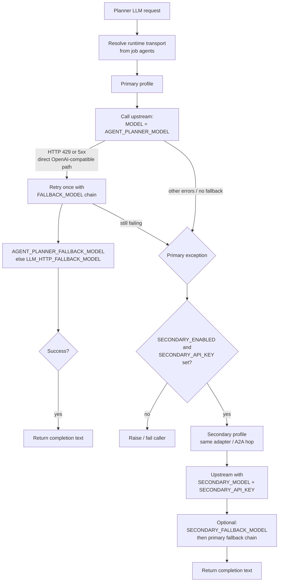

# Agent planner — admin & operations guide

This document is for **admins and operators** who configure the **platform agent planner** (BRD-style analysis, workflow split, tool suggestions, and related LLM calls). It explains environment variables, how retries and failover interact, and gives concrete examples.

For developer-facing A2A and task assignment details, see [A2A_TASK_AND_ASSIGNMENT.md](A2A_TASK_AND_ASSIGNMENT.md).

---

## What the planner does

When `AGENT_PLANNER_API_KEY` is set (and the planner is enabled), the **backend** uses a dedicated LLM configuration to:

- Analyze BRD / job context where applicable  
- Split work across hired agents (task split)  
- Suggest tool assignments from allowlists  
- Support execute-time replan (when enabled) and tool-picking flows  

Outputs can be persisted as **planner artifacts** (e.g. `brd_analysis`, `task_split`, `tool_suggestion`) for audit and UI.

Implementation lives mainly in `backend/services/planner_llm.py`, `backend/services/workflow_builder.py`, and job routes.

---

## Transport (how the platform reaches the model)

**There is no install-time “planner transport” switch** for normal multi-tenant use. Transport is chosen **at runtime** from the **hired agents** on the job:

| Situation | Typical transport |
|-----------|-------------------|
| No agents in context / direct path | **Direct** HTTP to the provider (`AGENT_PLANNER_BASE_URL` + key) or Anthropic API when `AGENT_PLANNER_PROVIDER=anthropic` |
| Any hired agent has A2A enabled | **Dedicated planner A2A adapter** — `AGENT_PLANNER_ADAPTER_URL` (do **not** reuse the hired-agent `A2A_ADAPTER_URL`) |
| (Rare) native A2A planner endpoint only | **Native A2A** — `AGENT_PLANNER_A2A_URL` (+ optional `AGENT_PLANNER_A2A_API_KEY` for the hop) |

Configure **endpoints and hop keys** once; runtime policy picks the path per job.

**Secondary planner failover** does **not** use a second adapter service. Primary and secondary share the same **`AGENT_PLANNER_ADAPTER_URL`** and **`AGENT_PLANNER_A2A_*`** hop settings. Only **upstream** credentials / model / base URL differ on the secondary profile.

---

## Primary vs fallback model vs secondary (mental model)

| Layer | Purpose | Same API as primary? |
|-------|---------|----------------------|
| **`AGENT_PLANNER_MODEL`** | Default model name for the **primary** planner profile | — |
| **`AGENT_PLANNER_FALLBACK_MODEL`** | If empty, **`LLM_HTTP_FALLBACK_MODEL`** may apply (planner-specific chain). Used for **one extra retry** on **429 / 5xx** on the **same** provider path (OpenAI-compatible chat or Anthropic messages) | **Yes** — another **model ID** on the **same** vendor API and **same** `AGENT_PLANNER_API_KEY` |
| **`AGENT_PLANNER_SECONDARY_*`** | **Separate profile** after the **primary profile throws** (e.g. exhausted credits, hard errors). Uses **`AGENT_PLANNER_SECONDARY_API_KEY`** and optional **`AGENT_PLANNER_SECONDARY_MODEL`**, **`AGENT_PLANNER_SECONDARY_BASE_URL`**, **`AGENT_PLANNER_SECONDARY_PROVIDER`** | Can point to **another vendor** (e.g. primary OpenAI, secondary Anthropic) — still **same** adapter/A2A hop as primary |

**Important:** You **cannot** put a Claude model ID in `AGENT_PLANNER_FALLBACK_MODEL` while `AGENT_PLANNER_PROVIDER=openai_compatible` and expect Anthropic to be called. Fallback is **not** cross-vendor. For OpenAI → Anthropic, use **secondary** with `AGENT_PLANNER_SECONDARY_PROVIDER=anthropic` (and Anthropic key).

---

## Flow diagram (primary → fallback model → secondary)



Step guardrails inside **job execution** (timeouts, output checks) are separate from this diagram; they apply to **hired agent** steps, not to this planner LLM stack unless you extend the product.

---

## Environment variables (cheat sheet)

Copy from repository root [`.env.example`](../.env.example) and tune.

### Primary planner

| Variable | Role |
|----------|------|
| `AGENT_PLANNER_ENABLED` | Master toggle (default on) |
| `AGENT_PLANNER_PROVIDER` | `openai_compatible` or `anthropic` / `claude` |
| `AGENT_PLANNER_BASE_URL` | OpenAI-compatible API base (empty often OK for default OpenAI) |
| `AGENT_PLANNER_API_KEY` | Upstream key for primary |
| `AGENT_PLANNER_MODEL` | Primary model id |
| `AGENT_PLANNER_FALLBACK_MODEL` | Same-vendor fallback model id (optional) |
| `AGENT_PLANNER_HTTP_TIMEOUT_SECONDS` | HTTP timeout |
| `AGENT_PLANNER_A2A_URL` | Native A2A planner URL (if used) |
| `AGENT_PLANNER_A2A_API_KEY` | Bearer for platform → planner hop (adapter + native hop reuse pattern in code) |
| `AGENT_PLANNER_ADAPTER_URL` | Dedicated planner adapter URL (when runtime picks adapter transport) |

### Shared (non-planner) fallback hint

| Variable | Role |
|----------|------|
| `LLM_HTTP_FALLBACK_MODEL` | Used when **`AGENT_PLANNER_FALLBACK_MODEL`** is empty, for the same “retry on 429/5xx” behavior on compatible paths |

### Secondary planner (failover profile)

| Variable | Role |
|----------|------|
| `AGENT_PLANNER_SECONDARY_ENABLED` | Turn on failover profile |
| `AGENT_PLANNER_SECONDARY_API_KEY` | **Required** for secondary to activate in failover logic |
| `AGENT_PLANNER_SECONDARY_PROVIDER` | Empty = inherit primary provider |
| `AGENT_PLANNER_SECONDARY_BASE_URL` | Empty = inherit primary base URL |
| `AGENT_PLANNER_SECONDARY_MODEL` | Empty = inherit primary model name |
| `AGENT_PLANNER_SECONDARY_FALLBACK_MODEL` | Same-vendor fallback for secondary path; empty inherits primary fallback chain |
| `AGENT_PLANNER_SECONDARY_HTTP_TIMEOUT_SECONDS` | Timeout for secondary calls |

There are **no** `AGENT_PLANNER_SECONDARY_ADAPTER_URL` or `AGENT_PLANNER_SECONDARY_A2A_URL` variables — secondary always reuses primary transport endpoints.

---

## Examples

### Example A — OpenAI primary, cheaper OpenAI fallback (same account)

```env
AGENT_PLANNER_PROVIDER=openai_compatible
AGENT_PLANNER_API_KEY=sk-primary
AGENT_PLANNER_MODEL=gpt-4o
AGENT_PLANNER_FALLBACK_MODEL=gpt-4o-mini
```

On **429 / 5xx**, the planner retries once with `gpt-4o-mini` at the **same** base URL and key.

### Example B — Use global LLM fallback when planner fallback is unset

```env
AGENT_PLANNER_MODEL=gpt-4o
AGENT_PLANNER_FALLBACK_MODEL=
LLM_HTTP_FALLBACK_MODEL=gpt-4o-mini
```

Planner code falls back to `LLM_HTTP_FALLBACK_MODEL` when the planner-specific fallback is empty.

### Example C — Primary OpenAI, secondary Anthropic (quota / credits)

```env
AGENT_PLANNER_PROVIDER=openai_compatible
AGENT_PLANNER_API_KEY=sk-openai
AGENT_PLANNER_MODEL=gpt-4o-mini
AGENT_PLANNER_ADAPTER_URL=http://a2a-planner-adapter:8080

AGENT_PLANNER_SECONDARY_ENABLED=true
AGENT_PLANNER_SECONDARY_PROVIDER=anthropic
AGENT_PLANNER_SECONDARY_API_KEY=sk-ant-...
AGENT_PLANNER_SECONDARY_MODEL=claude-3-5-sonnet-20241022
```

If the **primary profile** fails (exception after retries on that profile), the platform switches to **secondary** with the Anthropic key/model. Both still use the **same** `AGENT_PLANNER_ADAPTER_URL` hop.

### Example D — Secondary only for another OpenAI key (same provider)

```env
AGENT_PLANNER_API_KEY=sk-org-a
AGENT_PLANNER_MODEL=gpt-4o-mini
AGENT_PLANNER_SECONDARY_ENABLED=true
AGENT_PLANNER_SECONDARY_API_KEY=sk-org-b
AGENT_PLANNER_SECONDARY_BASE_URL=https://api.openai.com/v1
AGENT_PLANNER_SECONDARY_MODEL=gpt-4o-mini
```

Useful when **Org A** hits limits and **Org B** is the backup contract.

---

## Related docs

- [`.env.example`](../.env.example) — all commented variables  
- [A2A for developers](A2A_DEVELOPERS.md)  
- [A2A task & assignment](A2A_TASK_AND_ASSIGNMENT.md)  
- JSON Schema for Sandhi task envelope: [schemas/a2a/sandhi_a2a_task.v1.schema.json](schemas/a2a/sandhi_a2a_task.v1.schema.json)  

---

## Support checklist for ops

1. Confirm `AGENT_PLANNER_API_KEY` (and adapter URL if jobs use A2A agents) in **backend** and **worker** env.  
2. After changing `.env`, **recreate** containers that cache env (`docker compose up -d --force-recreate …`) if values look stale.  
3. Use **secondary** for cross-vendor or second-account backup; use **fallback model** only for same-vendor rate-limit / transient HTTP errors.  
4. Planner artifacts in the UI depend on jobs going through flows that persist them; empty sections often mean the job path did not run split/suggest or placeholders were used — see product behavior for your workflow origin (manual vs auto-split).
