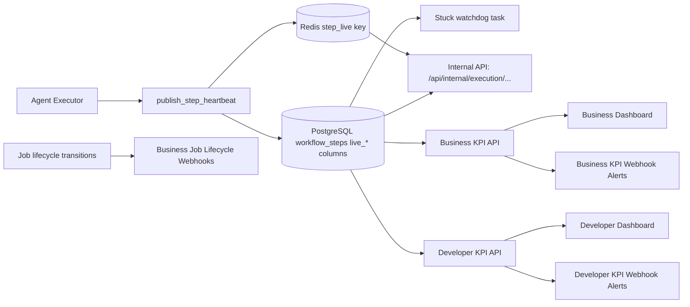
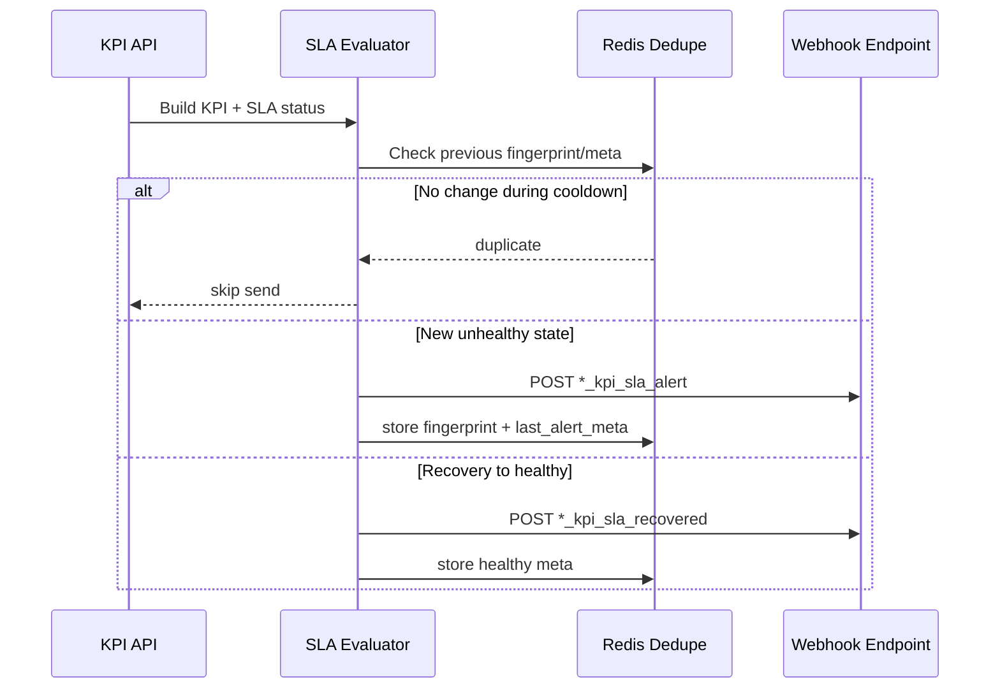

# Heartbeat, Runtime Telemetry, and KPI Guide

This guide explains how Sandhi AI tracks execution in real time, how it remains durable during Redis disruptions, and how KPI/SLA metrics and webhooks are produced for business and developer dashboards.

---

## Why This Exists

Production dashboards need two things at the same time:

- Fast live updates for active jobs
- Durable diagnostics for post-incident analysis

Sandhi uses a hybrid model:

- Redis stores **hot live state** for each step
- PostgreSQL stores **throttled durable snapshots** on each step row

If Redis restarts, diagnosis still works from DB fallback.

---

## Architecture Overview



---

## Heartbeat Internals

### 1) Where live heartbeat is written

Core service: `backend/services/execution_heartbeat.py`

- Redis key pattern: `sandhi:step_live:v1:{job_id}:{workflow_step_id}`
- Redis payload includes phase, reason, attempt, trace id, timestamps
- DB snapshot fields include:
  - `live_phase`
  - `live_phase_started_at`
  - `live_reason_code`
  - `live_reason_detail`
  - `live_trace_id`
  - `live_attempt`
  - `last_activity_at`
  - `last_progress_at`
  - `stuck_since`
  - `stuck_reason`

### 2) DB write throttling logic

DB snapshot is persisted when:

- meaningful progress is flagged, or
- phase changed, or
- minimum DB update interval elapsed (`HEARTBEAT_DB_MIN_UPDATE_SECONDS`)

This avoids high write pressure on PostgreSQL.

### 3) Stuck detection

Watchdog task (`check_stuck_workflow_steps`) evaluates in-progress steps and flags stuck states using:

- `STEP_STUCK_THRESHOLD_SECONDS`
- `STEP_STUCK_BLOCKED_THRESHOLD_SECONDS`
- `STEP_LOOP_ROUND_THRESHOLD`
- `STEP_REPEAT_TOOLCALL_THRESHOLD`
- `live_reason_detail` loop counters and repeat tool-call signals

Classification examples:

- `stuck`
- `looping`
- `slow_dependency`

### 4) Queue runtime telemetry (ops signal)

Queue health for execution throughput is exposed via:

- `GET /api/jobs/queue/stats`

Response fields:

- `execution_backend`
- `queue_name`
- `pending_jobs`
- `workers.online`
- `workers.active`
- `workers.reserved`

This signal helps explain delayed heartbeat updates caused by queue/worker pressure.

---

## Internal Ops API (Admin/Debug)

Endpoints:

- `GET /api/internal/execution/jobs/{job_id}/steps/live`
- `GET /api/internal/execution/jobs/{job_id}/steps/{step_id}/live`

Auth header:

- `x-internal-secret: <MCP_INTERNAL_SECRET>`

Behavior:

- Uses Redis live payload when available
- Falls back to DB snapshot if Redis is missing/unavailable
- `compact=true` returns high-signal fields for polling tables
- Compact defaults differ by endpoint:
  - Job steps endpoint defaults to compact mode.
  - Single-step endpoint defaults to non-compact mode.

---

## Example Payloads

### Redis step live payload (example)

```json
{
  "schema_version": "sandhi.step_live.v1",
  "job_id": 42,
  "workflow_step_id": 301,
  "step_order": 2,
  "agent_id": 17,
  "execution_token": "sched-9-a1b2c3",
  "phase": "calling_tool",
  "phase_started_at": "2026-04-08T13:45:10.201Z",
  "message": "Calling platform tool",
  "reason_code": "tool_call_started",
  "reason_detail": {
    "tool_name": "postgres_query",
    "round_idx": 2
  },
  "attempt": 1,
  "max_retries": 2,
  "last_update_ts": "2026-04-08T13:45:11.008Z",
  "last_progress_ts": "2026-04-08T13:45:10.201Z",
  "trace_id": "trc_9f52..."
}
```

### Internal API step live response (example)

```json
{
  "job_id": 42,
  "job_status": "in_progress",
  "execution_token": "sched-9-a1b2c3",
  "step": {
    "workflow_step_id": 301,
    "step_order": 2,
    "agent_id": 17,
    "status": "in_progress",
    "live_source": "redis",
    "live": {
      "phase": "calling_tool",
      "reason_code": "tool_call_started",
      "reason_detail": {
        "tool_name": "postgres_query"
      },
      "stuck_since": null
    }
  }
}
```

---

## KPI and SLA Mechanics

### Business KPI source

Endpoint: `GET /api/businesses/agents/performance`

Query param:

- `limit_steps` (default 500) controls KPI sample size.

Includes:

- overview: success/failure, steps, cost, tokens
- latency: avg/p50/p95
- windows: last 7d / 30d
- efficiency: cost per completed step, completion tokens per completed step
- failure mix and risk signals
- per-agent runtime context (`latest_runtime`) and failure drilldown (`recent_failures`)
- token rollups (`prompt_tokens_total`, `completion_tokens_total`, `total_tokens`)
- SLA:
  - `status`: `healthy` | `at_risk` | `breached`
  - thresholds and current values
  - `reason` (human-readable)
- alerts metadata:
  - `last_alert_sent_at`
  - `last_alert_status`

### Developer KPI source

Endpoint: `GET /api/developers/agents/performance`

Query param:

- `limit_steps` (default 800) controls KPI sample size.

Includes similar SLA and alerts metadata, tuned for publish-user endpoint performance.
Also includes per-agent SLA and risk fields such as `timeout_signals`.

### SLA status interpretation

- `healthy`: within configured success-rate and p95 latency thresholds
- `at_risk`: below one threshold
- `breached`: severe reliability degradation (for example high failure pressure + low success)

---

## Webhook Alerting

### 1) Business job lifecycle alerts

Service: `backend/services/business_job_alerts.py`

Events:

- `job_started`
- `job_stuck`
- `job_failed`
- `job_completed`

Envelope:

- `event = business_job_lifecycle`
- `event_type` carries lifecycle transition
- optional `share_url` can be provided for deep-link workflows

### 2) Business KPI SLA alerts

Service: `backend/services/business_kpi_alerts.py`

Events:

- `business_kpi_sla_alert` for `at_risk` and `breached`
- `business_kpi_sla_recovered` when returning to `healthy` after unhealthy state

### 3) Developer KPI SLA alerts

Service: `backend/services/developer_kpi_alerts.py`

Events:

- `developer_kpi_sla_alert` for `at_risk` and `breached`
- `developer_kpi_sla_recovered` when returning to `healthy` after unhealthy state

### Dedupe and cooldown

All alert services use Redis cooldown fingerprints to prevent duplicate floods.
KPI recovery alerts (`*_sla_recovered`) are sent only after a prior unhealthy state.
KPI webhook evaluation is triggered during KPI endpoint computation; webhook errors do not fail dashboard responses.

---

## Alert Flow Diagram



---

## Required and Useful Environment Variables

### Heartbeat

```env
HEARTBEAT_ENABLE_REDIS=true
HEARTBEAT_REDIS_URL=redis://redis:6379/0
HEARTBEAT_REDIS_TTL_SECONDS=180
HEARTBEAT_ENABLE_DB_SNAPSHOT=true
HEARTBEAT_DB_MIN_UPDATE_SECONDS=45
STEP_STUCK_THRESHOLD_SECONDS=600
STEP_STUCK_BLOCKED_THRESHOLD_SECONDS=900
STEP_LOOP_ROUND_THRESHOLD=10
STEP_REPEAT_TOOLCALL_THRESHOLD=6
```

### Developer KPI webhook

```env
DEVELOPER_KPI_ALERTS_ENABLED=true
DEVELOPER_KPI_ALERT_WEBHOOK_URL=https://example.com/dev-kpi-webhook
DEVELOPER_KPI_ALERT_COOLDOWN_SECONDS=900
DEVELOPER_KPI_SLA_SUCCESS_RATE_MIN=0.95
DEVELOPER_KPI_SLA_P95_LATENCY_SECONDS_MAX=30.0
```

### Business job lifecycle + KPI webhooks

```env
BUSINESS_JOB_ALERTS_ENABLED=true
BUSINESS_JOB_ALERT_WEBHOOK_URL=https://example.com/business-job-webhook
BUSINESS_JOB_ALERT_COOLDOWN_SECONDS=180

BUSINESS_KPI_ALERTS_ENABLED=true
BUSINESS_KPI_ALERT_WEBHOOK_URL=https://example.com/business-kpi-webhook
BUSINESS_KPI_ALERT_COOLDOWN_SECONDS=900
BUSINESS_KPI_SLA_SUCCESS_RATE_MIN=0.95
BUSINESS_KPI_SLA_P95_LATENCY_SECONDS_MAX=45.0
```

---

## Troubleshooting Playbook

### "Telemetry details are empty"

Check:

- `live_reason_detail` is present in DB fallback
- internal API returns `live_source = db_fallback` when Redis is down
- compact mode is not stripping expected fields

### "Step appears stuck but no reason"

Check:

- `last_progress_at`, `last_activity_at`, `stuck_since`, `stuck_reason`
- watchdog task execution
- threshold values (`STEP_STUCK_*`)

### "Too many webhook alerts"

Check:

- cooldown settings
- fingerprint dimensions (status + key metrics)
- repeated state flapping around thresholds

---

## Recommended Operator Workflow

1. Watch dashboard health dots and SLA reason text.
2. Open runtime drawer / step detail for affected agent.
3. If unclear, query internal execution API with `x-internal-secret`.
4. Use `trace_id`, `reason_code`, and `reason_detail` to identify root cause.
5. Tune thresholds/cooldowns only after reviewing multiple incidents.

---

## Related Docs

- `docs/AGENT_PLANNER_OPS.md`
- `docs/A2A_TASK_AND_ASSIGNMENT.md`
- `docs/OUTPUT_CONTRACTS.md`
- `backend/services/execution_heartbeat.py`
- `backend/api/routes/execution_internal.py`

